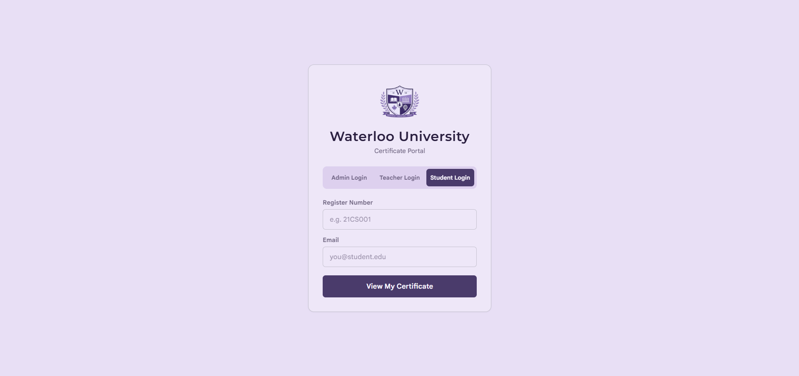
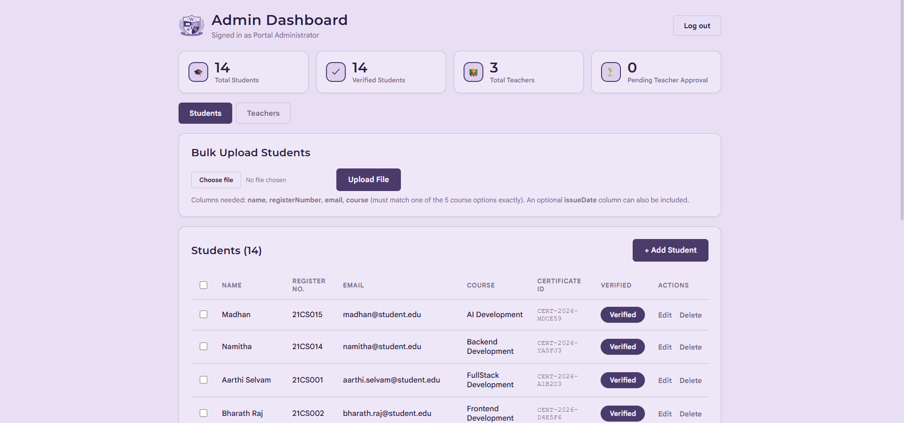
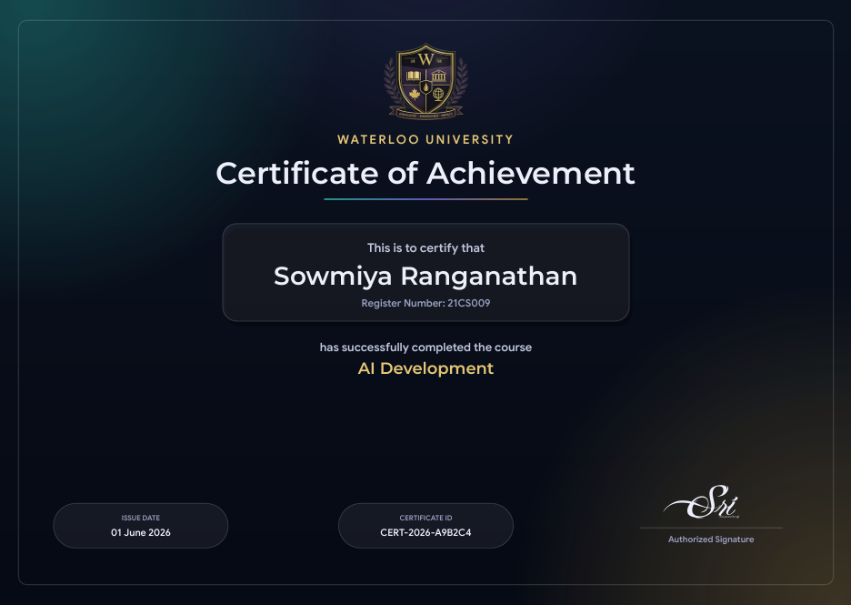

<p align="center">
  
</p>

<h1 align="center">Certificate Portal</h1>
<p align="center">Role-based certificate management, built for Waterloo University.</p>

<p align="center">
  
  
  
  
</p>

<p align="center">
  
  &nbsp;
  
</p>

---

### ▸ What it is

One portal, three logins. **Admins** manage students and teachers. **Teachers**
view, edit, and issue certificates. **Students** log in and download their own —
no password to remember, just their register number and email.

Every certificate is generated server-side as a PDF, styled to match the
university's own branding.

<p align="center">
  
</p>

---

### ▸ Who can do what

| | Admin | Teacher | Student |
|---|:---:|:---:|:---:|
| Create / edit students | ● | ● | — |
| Bulk add students & teachers (CSV / Excel) | ● | — | — |
| Verify students & teachers | ● | — | — |
| Grant bulk-download access | ● | — | — |
| View & edit student records | ● | ● | — |
| Download a single certificate | ● | ● | ● *(own only)* |
| Bulk-download certificates (ZIP) | — | ● | — |

---

### ▸ Stack

| Layer | Technology |
|---|---|
| Frontend | Angular 19 · Reactive Forms · RxJS |
| Backend | Node.js · Express · express-session |
| Database | MySQL 8 |
| PDF Engine | pdfkit · fonttools *(variable-font weight instancing)* |
| Fonts | Montserrat (headings) · Google Sans (body) |

---

### ▸ Highlights

- **Verification-gated access** — nothing is visible or downloadable until an admin approves it
- **Bulk operations** — add, delete, or download certificates in batches, with per-row error reporting
- **One PDF engine, every path** — single and bulk downloads render from the same code, so every certificate matches
- **Self-hosted fonts & artwork** — no external requests at generation time
- **Session-safe by design** — role switches across tabs are detected and handled gracefully

---

### ▸ Project structure

```
certificate-portal/
├── client/            Angular frontend
│   └── src/app/
│       ├── core/       services, guards, models
│       ├── features/   login, admin, teacher, student
│       └── shared/     design system, tokens
├── server/            Express backend
│   ├── src/
│   │   ├── routes/     auth, admin, teacher, student
│   │   └── utils/      PDF generator
│   ├── assets/         fonts, crest artwork
│   └── schema.sql
├── README.md
└── RUNBOOK.md          full setup guide
```

---

### ▸ Quick start

Full walkthrough in **[RUNBOOK.md](./RUNBOOK.md)**. Short version:

```bash
# database
mysql -u root -e "CREATE DATABASE certificate_portal;"
mysql -u root certificate_portal < server/schema.sql

# backend
cd server && npm install && npm start

# frontend
cd client && npm install && npm start
```

Open `http://localhost:4200`.

---

### ▸ Demo credentials

| Role | Login |
|---|---|
| Admin | `admin` / `admin123` |
| Teacher | `anitha.kumar@college.edu` / `teacher123` |
| Student | `21CS001` + `aarthi.selvam@student.edu` |

---

<p align="center">
  <sub>MIT License</sub>
</p>
